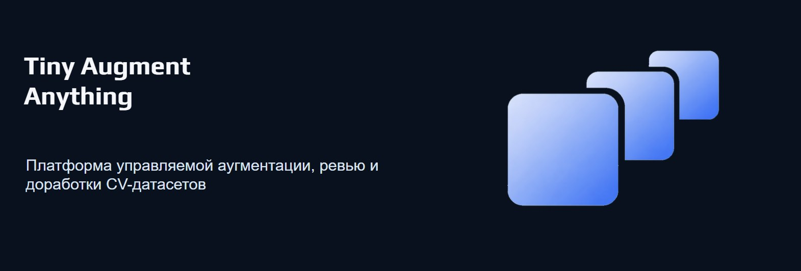
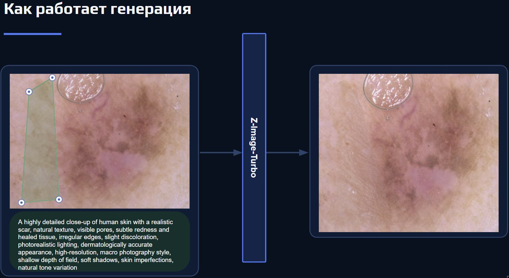
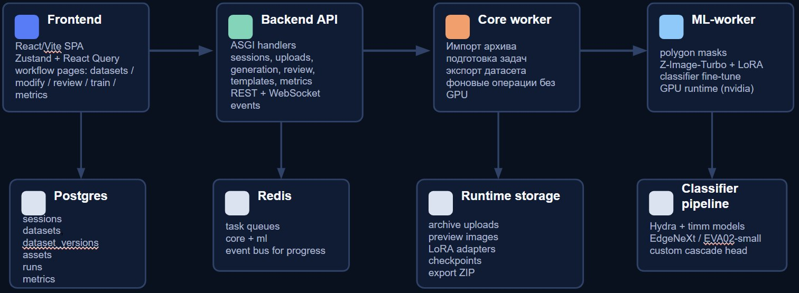
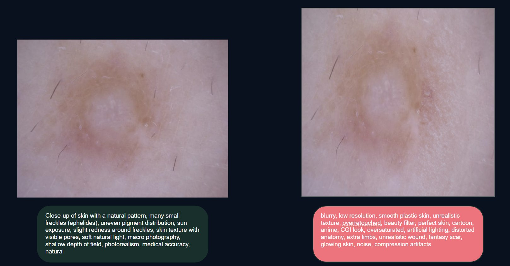

# tiny_augment_anything



Платформа для управляемой аугментации, review и доработки CV-датасетов с единым workflow: от загрузки архива и генерации новых изображений до отбора результатов и обучения классификатора.

## Установка и запуск

Базовый локальный сценарий рассчитан на запуск через Docker Compose.

Клонирование репозитория:

```bash
git clone [<repository-url>](https://github.com/dolganin/tiny_augment_anything.git)
cd tiny_augment_anything
```

Подготовка локального конфига и runtime-директорий:

```bash
cp config/app.yaml.example config/app.yaml
cp .env.example .env
mkdir -p storage/tiny-augment
```

Запуск сервисов:

```bash
docker compose up --build
```

После старта:

- frontend будет доступен на `http://localhost:5444`;
- backend API будет доступен на `http://localhost:8000`;
- healthcheck backend: `http://localhost:8000/api/health`.

Для полноценной работы `ml-worker` нужен CUDA/NVIDIA runtime. Если GPU worker должен реально выполнять генерацию и обучение, Docker host должен поддерживать `nvidia-container-runtime`, а окружение должно уметь поднимать CUDA-compatible контейнеры.

## Пайплайн работы

Работа в приложении устроена как последовательный workflow по стадиям:

1. Импортировать zip-архив с изображениями или открыть уже существующий проект.
2. Проверить статистику датасета и выбрать классы, с которыми будет идти работа дальше.
3. Настроить single или batch модификацию в рабочем режиме `/modify`.
4. Запустить генерацию или модификацию изображений через ML pipeline.
5. Просмотреть результаты в review и отфильтровать удачные варианты.
6. Либо сохранить отобранные результаты обратно в датасет, либо передать их в этап обучения.
7. Запустить обучение классификатора и анализировать метрики на следующем этапе.

В интерфейсе workflow проходит через страницы `/datasets` → `/dataset/stats` → `/modify` → `/review` → `/classifier/train` → `/metrics`.



## Системные требования

Минимальная practical-конфигурация для локального запуска:

- Docker и Docker Compose;
- Node.js 20+, если запускать frontend отдельно;
- Python 3.10+, если запускать части backend или ML-инструменты вне контейнеров;
- PostgreSQL 16 и Redis 7, если не использовать compose;
- NVIDIA GPU и CUDA-compatible container runtime, если нужен полноценный `ml-worker`.

Без GPU **проект бессмысленен**.

## Как устроен проект

Пользователь проходит pipeline через страницы `/datasets` → `/dataset/stats` → `/modify` → `/review` → `/classifier/train` → `/metrics`, а под капотом это поддерживается несколькими сервисами: `frontend` отвечает за интерфейс, `backend` за API и orchestration, `worker` за фоновые CPU-задачи, `ml-worker` за GPU-генерацию и обучение, `postgres` хранит состояние проекта, `redis` держит очереди и события, а `storage` содержит runtime-артефакты. Диаграмма ниже показывает, как эти части связаны между собой.



## Manual scripts

Каталог [`scripts_for_gen/`](/workspace_0/code/YSDA/ML_spring/tiny_augment_anything/scripts_for_gen) содержит standalone утилиты для ручной подготовки данных и экспериментов. Backend не вызывает их напрямую как часть обычного user flow.

Примеры:

```bash
python scripts_for_gen/segment_evf_sam2_json.py --input-json data/input.json --output-json data/output.json
python scripts_for_gen/segment_sam2_json.py --input-json data/input.json --output-json data/output.json
python scripts_for_gen/train.py --config scripts_for_gen/train.yaml
```

## Пример результата

Ниже пример пары изображений и промптов, с которыми работает пайплайн при генерации и последующем review качества:


